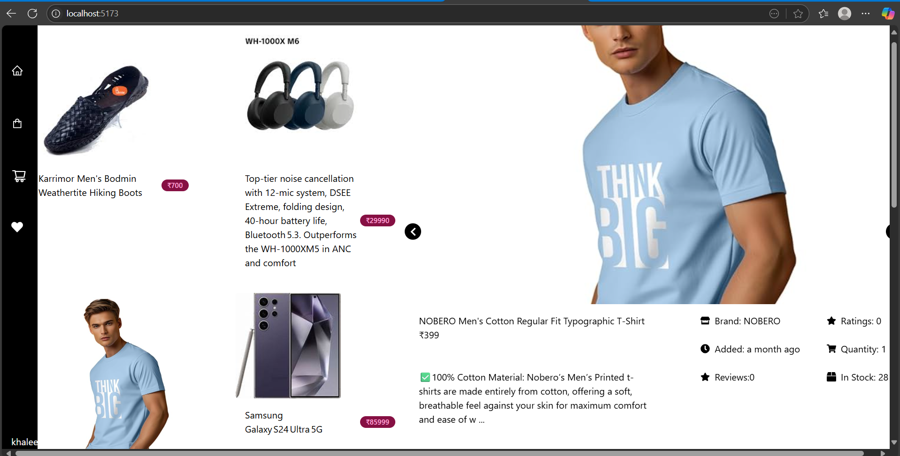

# 🛒 E-commerce Website

A full-stack e-commerce web application built with modern web technologies.

## 🚀 Features

- 🛍️ Product Listings
- 🔍 Product Search & Filtering
- 🧺 Add to Cart
- 💳 Online Payment Integration
- 🔐 User Authentication & Authorization
- 📦 Order Management
- 🛠️ Admin Dashboard

## 🧰 Tech Stack

**Frontend:**
- React.js
- Tailwind CSS

**Backend:**
- Node.js
- Express.js
- MongoDB

**Payment Gateway:**
- Razorpay

## 📦 Installation

1. Clone the repo:
   ```bash
   git clone https://github.com/chetturuKhaleel1/ecommerce-website.git
   cd ecommerce-website

2. Install frontend dependencies:
   ```bash
   cd client
   npm install


3.Install backend dependencies:

cd ../server
npm install

4.Set up environment variables:
MONGO_URI=your_mongodb_connection
JWT_SECRET=your_jwt_secret
RAZORPAY_KEY=your_razorpay_key
RAZORPAY_SECRET=your_razorpay_secret


5.Run the application:
In one terminal, run backend:


cd server
nodemon index.js
In another terminal, run frontend:


Copy code
cd client
npm run dev

6.Open in browser:
http://localhost:5173

## 📸 Project Preview

Here’s a quick look at the UI of the application:


